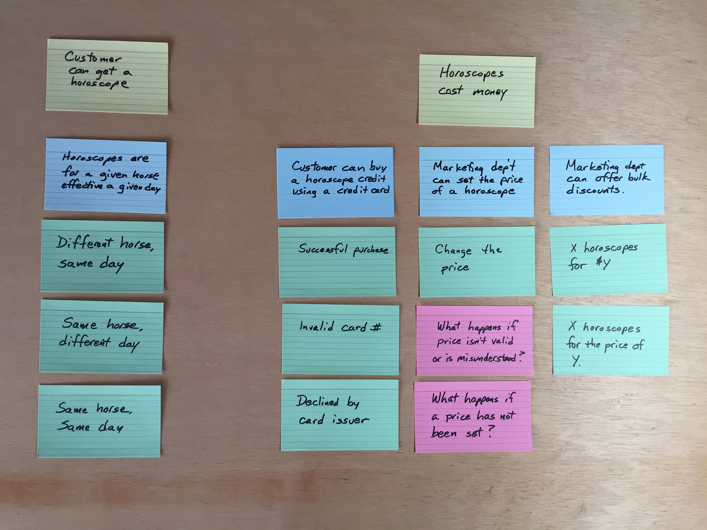

# EquineHoroscope

I think I got this project idea from a software development book back in the mid 1980s, but I haven't been able to identify the book. Perhaps it was a dream. I've built parts of this system a couple times, planning to use it for demos and classes. It goes out of date, however. The tools change, libraries change, computing environments change. It's very, very hard to keep a program in compilable condition without frequent attention over the years. So, I'm starting over and putting it in public this time.

## The "Requirements"

The core of the idea is to provide horoscopes for racehorses on race day. This gives the savvy bettor a leg up on the competition, allowing them to do better than the track odds predict. That's true, if the horoscopes work. Of course, no prediction mechanism works all the time. So if the horoscope doesn't pan out, it's just your bad luck. Try again, and I'm sure you'll win back your money. Horoscopes and horse-racing seem a natural combination.

Back in the 1980s it seemed like a novel idea to me. Now, a Google search shows me that people are in that very business. No matter. I will persevere.

I started with an example map (See https://cucumber.io/blog/2015/12/08/example-mapping-introduction) of the initial features.

The **yellow** cards are Features. The **blue** cards are business rules. The **green** cards are scenarios I'll want to consider. And the **red** cards are questions.

## The Code

The code base started with [a fork](https://github.com/gdinwiddie/cucumber-java-skeleton/tree/eclipse-ready) of https://github.com/cucumber/cucumber-java-skeleton modified for working in Eclipse.

Right now, it has one passing scenario. This scenario calls an instance of CrystalBall and ensures that the returned horoscope is not blank. That's not much of a test, but it is enough to force a rudimentary API into existence.

What can force an actual implementation?

We could...

1. **Triangulate using scenarios** If we implement the next scenario, *Different horse, same day,* then we would expect a different horoscope. Since we're currently returning the same string all the time, it will force us to do something a little more clever, such as generate an actual horoscope.

2. **Dig deeper with unit tests** 

This also gives us two possibilities. We could...

1. Use an **interaction-based unit test**, where we specify the interactions with a collaborating object (using a mock). This is often called the *Mockist or London style of unit testing.*

2. Use a **state-based unit test**, where we interact with a collaborating object and then check the state. This is often called the *Classical or Detroit school of unit testing.*

See Martin Fowler's article, [Mocks Aren't Stubs](http://martinfowler.com/articles/mocksArentStubs.html) for a quick overview on the topic.

### Digging Deeper

While working on the next scenario will induce some sort of difference in the returned horoscope, implementing that difference will either be a detour into more detailed faking it ("If this then return that constant nonsense, else return another constant nonsense."), or will be a large step into implementing a real backend for the functionality.

It's easy to fall into a trap of trying to drive all the code from acceptance tests. I recommend against that strategy. I've gotten better results switching to unit tests when fleshing out the implementation. This way I avoid the combinatorial explosion of trying to prove all possibilities from the end-user point of view. It makes refactoring easier, too. As I refactor my code using Eclipse' refactoring tools, it keeps my unit tests up-to-date.

### Quick Design Discussion

What do I currently know about my system design?

1. That CrystalBall is the top-level domain service. It will end up coordinating other components to make the fetchHoroscope call work, but will delegate the details to those components.

2. That the actual horoscopes will be generated by a Random Sentence Generator based on a Context Free Grammar specification. Decades ago, I had a copy of the program 'spew' and had developed a grammar to generate quite realistic National Enquirer headlines. The same technique seems well-suited to generating horoscopes.

As it happens, I've got such a library, Mumbles, written by Shannon Code years back when we were going to collaborate on this project. We'll use it here just as a black-box third-party library, mumbler.jar. Since this library is beyond the scope of the source code being developed, I'll naturally use the Adapter Pattern to talk with it. This allows me to isolate any idiosyncracies, and provide an API that is convenient for my code to consume. This is a rudimentary implementation of [Hexagonal Architecture](http://c2.com/cgi/wiki?HexagonalArchitecture) or the [Ports and Adapters Pattern](http://c2.com/cgi/wiki?PortsAndAdaptersArchitecture). One of the many advantages of this pattern is that the adapters are a natural [seam](http://www.informit.com/articles/article.aspx?p=359417&seqNum=2) for substituting a [test double](http://www.martinfowler.com/bliki/TestDouble.html) for testing in isolation.

### First Unit Test

My first test temporarily duplicates the check performed by the first acceptance test. Both of these are simple triggers to drive development, and will disappear or morph into something more meaningful in the future.

In order to test something more robust than the existence of a horoscope, I'll create a fake HoroscopeProvider for testing. That necessitates modifying CrystalBall to depend on a horoscope provider, and provide a means of supplying one. I decided to use constructor injection, modifying the no-argument constructor to supply one that contains the original temporary functionality.

