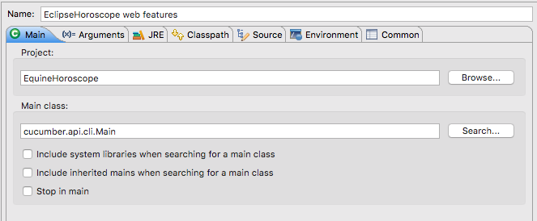
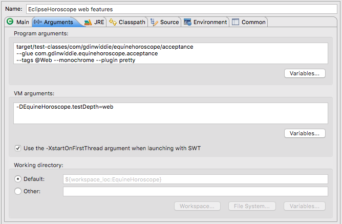

# EquineHoroscope

I think I got this project idea from a software development book back in the mid 1980s, but I haven't been able to identify the book. Perhaps it was a dream. I've built parts of this system a couple times, planning to use it for demos and classes. It goes out of date, however. The tools change, libraries change, computing environments change. It's very, very hard to keep a program in compilable condition without frequent attention over the years. So, I'm starting over and putting it in public this time.

## The "Requirements"

The core of the idea is to provide horoscopes for racehorses on race day. This gives the savvy bettor a leg up on the competition, allowing them to do better than the track odds predict. That's true, if the horoscopes work. Of course, no prediction mechanism works all the time. So if the horoscope doesn't pan out, it's just your bad luck. Try again, and I'm sure you'll win back your money. Horoscopes and horse-racing seem a natural combination.

Back in the 1980s it seemed like a novel idea to me. Now, a Google search shows me that people are in that very business. No matter. I will persevere.

I started with an example map (See https://cucumber.io/blog/2015/12/08/example-mapping-introduction) of the initial features.

The **yellow** cards are Features. The **blue** cards are business rules. The **green** cards are scenarios I'll want to consider. And the **red** cards are questions.

## The Code

The code base started with [a fork](https://github.com/gdinwiddie/cucumber-java-skeleton/tree/eclipse-ready) of https://github.com/cucumber/cucumber-java-skeleton modified for working in Eclipse.

Note: the `lib` directory containing the jars is zipped into http://idiacomputing.com/pub/EquineHoroscopeJars.zip

Right now, it has one passing scenario. This scenario calls an instance of CrystalBall and ensures that the returned horoscope is not blank. That's not much of a test, but it is enough to force a rudimentary API into existence.

What can force an actual implementation?

We could...

1. **Triangulate using scenarios** If we implement the next scenario, *Different horse, same day,* then we would expect a different horoscope. Since we're currently returning the same string all the time, it will force us to do something a little more clever, such as generate an actual horoscope.

2. **Dig deeper with unit tests** 

This also gives us two possibilities. We could...

1. Use an **interaction-based unit test**, where we specify the interactions with a collaborating object (using a mock). This is often called the *Mockist or London style of unit testing.*

2. Use a **state-based unit test**, where we interact with a collaborating object and then check the state. This is often called the *Classical or Detroit school of unit testing.*

See Martin Fowler's article, [Mocks Aren't Stubs](http://martinfowler.com/articles/mocksArentStubs.html) for a quick overview on the topic.

### Digging Deeper

While working on the next scenario will induce some sort of difference in the returned horoscope, implementing that difference will either be a detour into more detailed faking it ("If this then return that constant nonsense, else return another constant nonsense."), or will be a large step into implementing a real backend for the functionality.

It's easy to fall into a trap of trying to drive all the code from acceptance tests. I recommend against that strategy. I've gotten better results switching to unit tests when fleshing out the implementation. This way I avoid the combinatorial explosion of trying to prove all possibilities from the end-user point of view. It makes refactoring easier, too. As I refactor my code using Eclipse' refactoring tools, it keeps my unit tests up-to-date.

### Quick Design Discussion

What do I currently know about my system design?

1. That CrystalBall is the top-level domain service. It will end up coordinating other components to make the fetchHoroscope call work, but will delegate the details to those components.

2. That the actual horoscopes will be generated by a Random Sentence Generator based on a Context Free Grammar specification. Decades ago, I had a copy of the program 'spew' and had developed a grammar to generate quite realistic National Enquirer headlines. The same technique seems well-suited to generating horoscopes.

As it happens, I've got such a library, Mumbles, written by Shannon Code years back when we were going to collaborate on this project. We'll use it here just as a black-box third-party library, mumbler.jar. Since this library is beyond the scope of the source code being developed, I'll naturally use the Adapter Pattern to talk with it. This allows me to isolate any idiosyncracies, and provide an API that is convenient for my code to consume. This is a rudimentary implementation of [Hexagonal Architecture](http://c2.com/cgi/wiki?HexagonalArchitecture) or the [Ports and Adapters Pattern](http://c2.com/cgi/wiki?PortsAndAdaptersArchitecture). One of the many advantages of this pattern is that the adapters are a natural [seam](http://www.informit.com/articles/article.aspx?p=359417&seqNum=2) for substituting a [test double](http://www.martinfowler.com/bliki/TestDouble.html) for testing in isolation.

### First Unit Test

My first test temporarily duplicates the check performed by the first acceptance test. Both of these are simple triggers to drive development, and will disappear or morph into something more meaningful in the future.

In order to test something more robust than the existence of a horoscope, I'll create a fake HoroscopeProvider for testing. That necessitates modifying CrystalBall to depend on a horoscope provider, and provide a means of supplying one. I decided to use constructor injection, modifying the no-argument constructor to supply one that contains the original temporary functionality.

### A Real Horoscope Provider

Now that I'm using a fake HoroscopeProvider in my unit test of CrystalBall, I want to create a real HoroscopeProvider for production. Since this is dependent on my third-party library, Mumbler, I'll consider it an integration test. It just so happens that this integration test runs quickly, all in the same JVM. It could be, though, that someday this library will be deployed as a separate service. I don't want my code to care, other than the internals of my HoroscopeProvider, MumblerAdapter.

I'll test-drive that adapter. Notice that "uut" is short for "unit under test." That's a convention I've used for decades.

1. Make sure I can retrieve a horoscope via the MumblerAdapter.
2. Make sure that Mumbler delivers a variety of horoscopes. This requires using a more complicated grammar file.

### Popping back up to the Business Level, or not

Implementing the next scenario, which expects different horoscopes, caused us to notice that the MumblerAdapter wasn't hooked to the CrystalBall. Instead, it had a dummy HoroscopeProvider that returned the same horoscope all the time.

Note, however, that if we run this test multiple times, it sometimes fail. Sometimes our generator creates the same horoscope twice in a row. This gives us "flaky" or "blinking" tests that sometimes pass and sometimes fail without any significant changes. These tests can make us not trust our test suite, so we'd better do something about it. 

We have a similar problem in MumblerAdapterTest, but there it would have to be the same 5 times in a row. We can quit running MumblerAdapterTest (I've marked it @Ignored for now) because it's testing behavior of Mumbler, itself, not the adapter. It could be worth dusting off that test if we receive a new version of Mumbler and want to verify it still works. 

The "different horse, same day" scenario is more problematic. We do want to check this behavior with the full system stack, but the behavior in our scenario is not guaranteed. In fact, it's not even really a business requirement. While we don't want our horoscopes to be monotonously repetitious, it's OK if a horoscope is repeated. We DO have a business requirement for horoscopes for the same horse on the same day to be consistent, else we blow our illusion of authenticity. Perhaps we'd do better testing the "different horse, same day" scenario in CrystalBallTest, substituting a controllable HoroscopeProvider.

To make the "same horse, same day" scenario return consistent results, we need to cache the results we got and reuse them. Ultimately we need to cache them in a database, so they'll persist across reboots. We'll start with something simpler, though.

We've built an InMemoryHoroscopeCache using Test Driven Development. We can demonstrate that our "same horse, same day" scenario works using this cache. It leaves us in a bit of a pickle, though. This cache code is in the src/test/java tree, not src/main/java.

In the long run, we want to cache in a database so it persists across reboots. I *could* write a test that forces this. I've done it before, though, and find it a bit artificial. I don't necessarily need to turn all my architectural into business-facing tests. For me, it's good enough that my tests show the ultimate behavior is unchanged with a different mechanism.

The database cache has been test-driven using the Apache Derby (https://db.apache.org/derby/) database engine.

Now we substitute this cache for the in-memory one, and relegate the in-memory cache just for testing

## Story 2: Horoscopes Cost Money

First we need to be able to process credit cards. Then we'll return the horoscope to the customer IFF the transaction is successful.

We're using test credit card numbers from https://docs.balancedpayments.com/1.1/overview/resources/
The credit card validation code is borrowed from Apache Commons 1.5.0 (http://svn.apache.org/viewvc/commons/proper/validator/tags/VALIDATOR_1_5_0/src/main/java/org/apache/commons/validator/routines/)

Successfully completing a credit card transaction is a bit harder than the failure scenarios. We now need an actual credit card processor.  Or, we will. One step at a time... Let's use the Adapter Pattern to isolate our system from an external processor. Then we can use a Fake Adapter to simulate the behavior of collaborating with that external system. Temporarily we'll hardwire the Fake Adapter. Then we'll put it under the control of the tests. In the future, we'll want to test our real adapter with the external system, and have a test or two checking the integration of our system and that one.

Lacking a real credit card processor, or even a real credit card test system, we've created our own using Moco (or, rather, a fork of that project with a fix for a small bug we ran into). You can start this test server for interactive use with `java -jar lib/moco-runner-0.11.0-SNAPSHOT-uber.jar http -p 12000 -c src/test/resources/com/gdinwiddie/creditcardprocessor/merchantbank/moco_config.json`

The tests start the same server on a different port, as needed, for the duration of each test.

This test server allows us to test our real adapter `/EquineHoroscope/src/main/java/com/gdinwiddie/creditcardprocessor/merchantbank/JsonMerchantBankAdapter.java`.

### Putting the pieces together

Now that we can generate horoscopes, and charge credit cards, it's time to tie the two together. When a customer requests a horoscope, we'll first charge their card and then deliver the horoscope.

#### API level

We've started at the API level, beneath the GUI. As suggested by our first `buy_a_horoscope` scenario, we take in both the credit card information and which horoscope (horse and date) that we want. If the credit card charge goes through, we return a horoscope.

Note that we're sharing a few things from our lower-level step definitions when we put it together for retail sales. We've made the named credit cards visible from `CreditCardStepDefinitions` and we've extracted out the storage of returned horoscopes from `CrystalBallStepDefinitions`. Duplication will hurt us in test code the same way it does in production code.

It's a pretty simple API at this point. We could imagine many directions to enhance it, but that would be driven by our imagination. Instead, let's push through to the GUI layer. This will let us interact directly with the application. We'll get new insights by doing that, and we can also show it to others.

#### GUI level

We'll want to be able to verify the functionality through the GUI that we can via the API. That means we want to reuse the `buy_a_horoscope.feature` file and associated `RetailStepDefinitions.java`. Instead of the step definitions talking to the API, though, we want them to talk to the GUI. We'll extract the API interface and create a API and GUI adapters that can do the same actions. Then we can inject one or the other to test via the GUI or via the API.

Now that we've extracted the API level adapter, `EquineHoroscopeRetailApiAdapter`, we can create a similar adapter, `EquineHoroscopeRetailWebAdapter`, to purchase a horoscope at the GUI level. For that, we'll use Selenium to drive a web browser. Note that we can do that even though the web GUI has not yet been created.

We can run the web features by defining `EquineHoroscope.testDepth=web` and, to limit the run just to web-related scenarios, specifying the tag `@Web`. Do this by invoking Maven with

    mvn -Dtest=RunCukesTest -Dtags=@Web -DEquineHoroscope.testDepth=web test

or as an Java Application within Eclipse

*Note that neither of these currently pass, since we don't have a web application running.*

